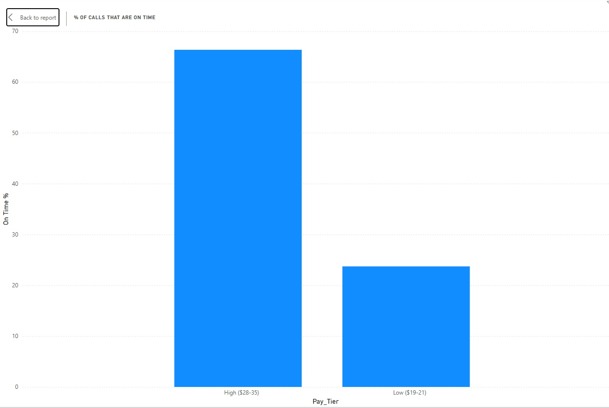
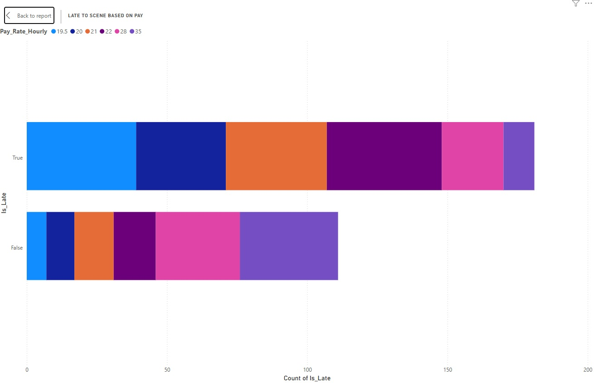
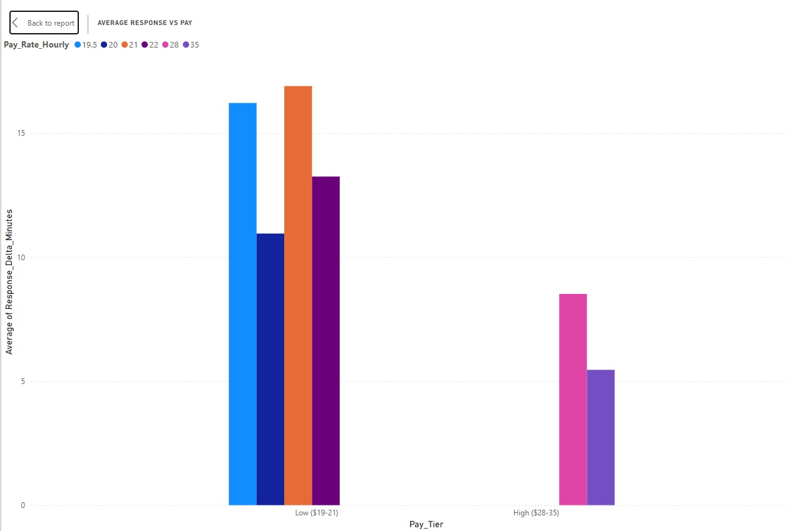

# Healthcare Ambulance Response Performance Analysis

**Understanding the Impact of EMT Pay and Call Volume on Response Times**

## Project Overview

This project examines real ambulance performance data to identify what actually drives better (or worse) response times in NYC hospital systems. With over 5 years of experience as an EMT — working with Mount Sinai, NYC Health + Hospitals, Rikers transports, nursing homes, and multiple ambulance companies — I wanted to use data to test what I saw on the ground: that pay rate has a major effect on how fast crews actually move.

## Business Problem

Ambulance delays contribute to ER wait times and overall hospital inefficiency. Hospitals need clear evidence on what levers actually improve performance when awarding contracts.

## Data & Cleaning Process

**Python (`clean_ambulance_data.py`)**  
- Loaded messy raw CSV using pandas  
- Standardized messy Company names (MountSinai, MSHS, Mount Sinai EMS, etc. → "Mount Sinai")  
- Standardized Call Types and fixed mixed date formats  
- Fixed impossible negative response deltas (flagged and clipped)  
- Created key columns: Pay_Tier, Is_Late, Had_Negative_Delta  
- Removed incomplete rows  

**Excel Manual Cleanup**  
- Imputed missing Actual_Response_Minutes with column average (~19)  
- Removed rows with "Unknown" Shift_Type that had too many missing values  
- Final review and formatting  

Final clean dataset: ~292 usable records.

## Key Visuals (Power BI):







## SQL Analysis

I used SQL to explore whether high daily call volume contributes to longer response times:

```sql
-- Overall Averages
SELECT AVG(c7) AS Avg_Delta FROM ambulance_response_data_CLEAN;           -- ~11.90 minutes
SELECT AVG(c13) FROM ambulance_response_data_CLEAN;                     -- ~54 calls/day

-- High Volume + High Delta Calls
SELECT c13 AS Daily_Vol, COUNT(*) as Quant 
FROM ambulance_response_data_CLEAN
WHERE c7 > 12 AND c13 > 54
GROUP BY c8
ORDER BY c13 DESC;                                                      -- Result: 83 calls
```

## Core Insights:

- Higher EMT pay rates ($28–$35/hr) are strongly associated with much better response performance and significantly fewer late calls.
- Low pay brackets show consistently worse deltas and higher late counts.
- Daily call volume has a noticeable but weaker effect. Hospitals can still manage this by more evenly distributing calls across companies to avoid overloading any single provider.

Bottom line: While call volume balancing is something hospitals can control with relatively little resistance, improving EMT compensation appears to be the most impactful lever for reducing response delays.

## Technologies Used

- Python (pandas) – Data cleaning
- SQL – Exploratory analysis
- Power BI – Visualizations & Dashboard
- Excel – Manual validation